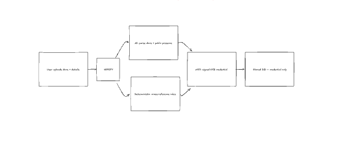
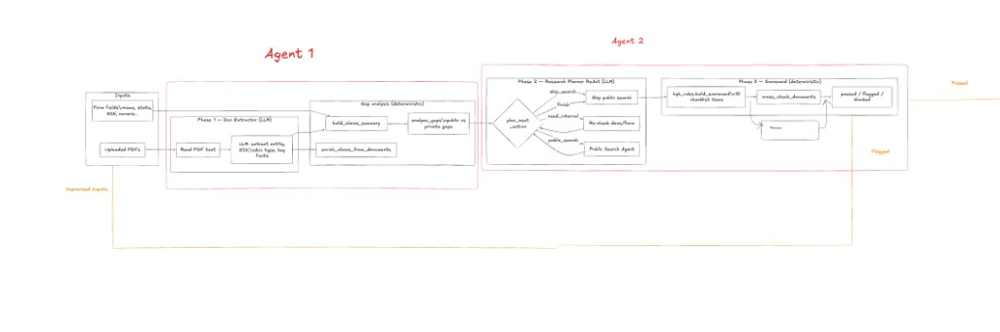
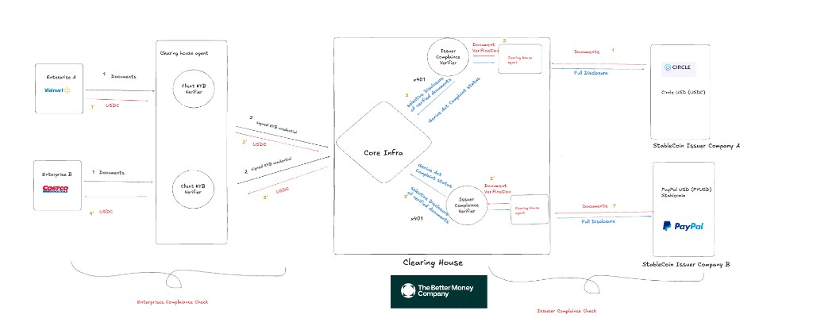

# TBMC Compliance Agent

Enterprise KYB onboarding and stablecoin issuer compliance demo for [The Better Money Company](https://bettermoney.com/).

## Links

| | |
|---|---|
| **Live demo** | https://tbmc-compliance-agent.netlify.app/ |
| **Walkthrough (Loom)** | https://www.loom.com/share/c97c2410af704740ba6c993c99490d21 |
| **Architecture board (Excalidraw)** | https://excalidraw.com/#room=fbf6b8f50a7e7c805d12,uEXrjJL7_PvYBFUATagN1w |

---

## High-level view

### End-to-end flow

User uploads documents and company details → **VERIFY** (AI + rules) → signed KYB credential stored (credential only, not raw uploads).



### Agent pipeline (Enterprise KYB)

Two-agent design: LLM steps for extraction and research planning; deterministic steps for gaps, rules, and scorecard.



### Product architecture

Clearinghouse sits between **enterprises** (KYB) and **stablecoin issuers** (reserve / GENIUS Act compliance). Client verifiers issue credentials; core infra routes settlement.



---

## What is implemented (demo)

**Enterprise KYB (live in demo)**

- Trial company: **Riverstone Holdings** — 8-document mock KYB package
- Wizard: Application → Scorecard → Network
- Document upload, form auto-fill, verification checklist (10 items)
- AI doc extraction + public search + research planner (when API keys are set)
- Deterministic KYB rules → Passed / Flagged / Blocked
- **Layered credentials** C1–C4 (KYC, KYB, combined, master proof)
- **x401-style compliance credential** (simulated issuer-side signing, Ed25519)
- Separate PDF certificates (Compliance, KYC, KYB, KYA agent audit)
- Clearinghouse **network graph** (volume-sized nodes, new member admission)
- **Agent cost** breakdown (live / cache / fixture parsing)
- Optional Postgres persistence when `DATABASE_URL` is set

**Issuer compliance**

- UI shell only — coming soon

**Deploy**

- Frontend: Netlify  
- API: Railway (`tbmc-compliance-api-production.up.railway.app`)

---

## Stack

- **Frontend** — static HTML/CSS/JS (`frontend/`)
- **Backend** — FastAPI (`backend/`)

## Quick start (local)

```bash
# Backend
cd backend
python3 -m venv .venv && source .venv/bin/activate
pip install -r requirements.txt
cp .env.example .env   # ANTHROPIC_API_KEY for live LLM calls
uvicorn app.main:app --reload --port 8000

# Frontend
cd frontend
python3 -m http.server 5173
```

Open http://127.0.0.1:5173

---

## Notes

- **x401** is simulated at credential issuance (not the full HTTP PROOF handshake). See `agent-skill/Claude_context.md` for scope.
- **Riverstone mock docs** use deterministic parsing (no LLM) — shown as “Simulated” in agent cost.
- Deploy details: `README.Docker.md`, `netlify.toml`, Railway service `tbmc-compliance-api`.
